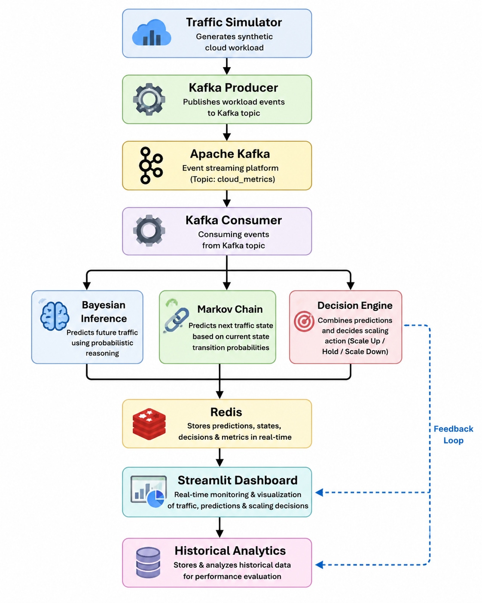
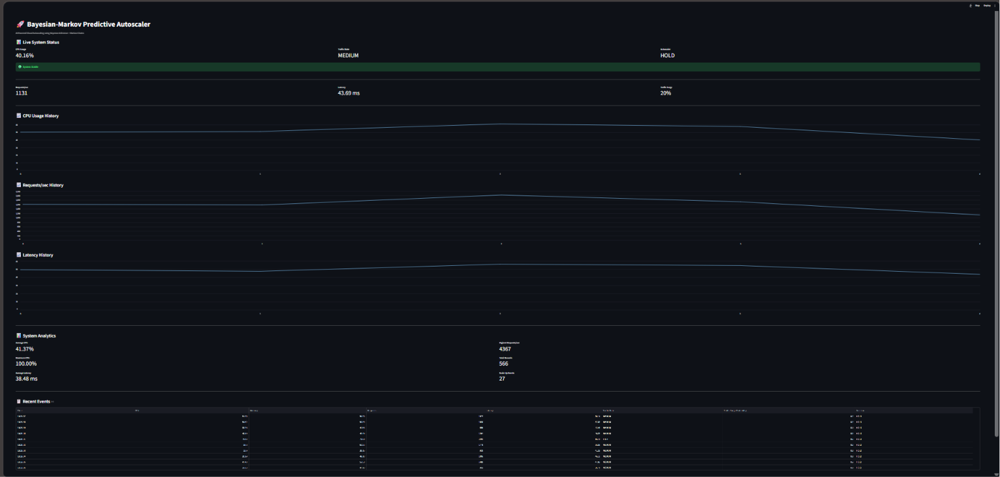
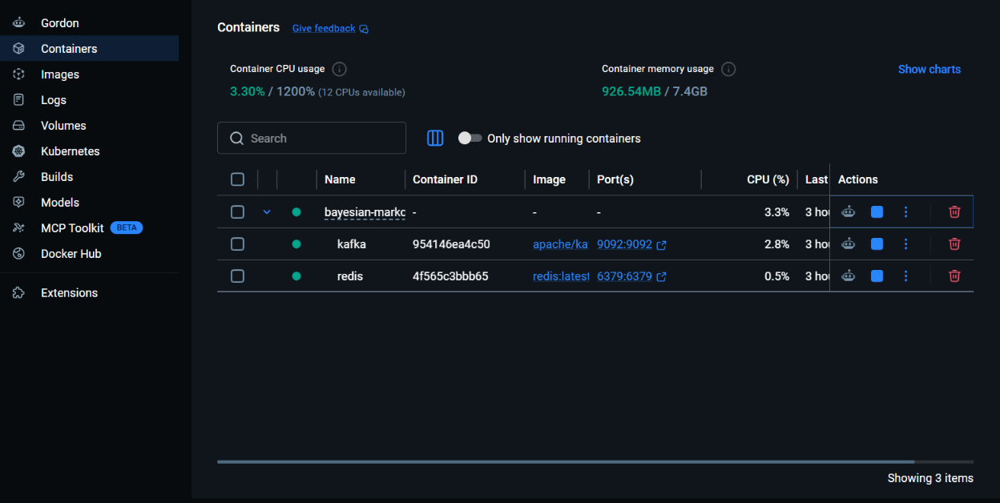
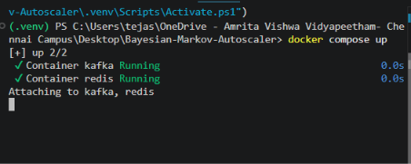
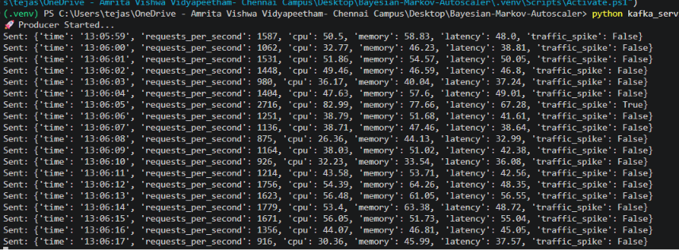
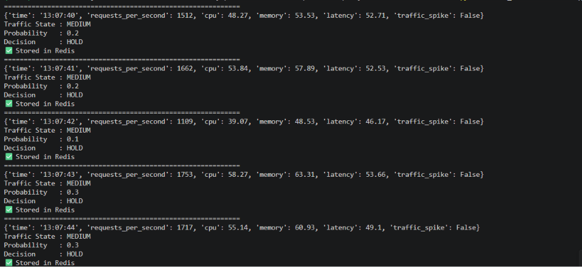

# 🚀 AI-Powered Bayesian-Markov Predictive Cloud Autoscaler

An intelligent cloud autoscaling system that predicts workload traffic and recommends scaling actions using **Bayesian Inference** and **Markov Chains**. The system processes live traffic using **Apache Kafka**, stores real-time metrics in **Redis**, and visualizes results through an interactive **Streamlit Dashboard**.

---

## 📌 Project Overview

Cloud applications experience fluctuating workloads throughout the day. Efficient resource allocation is essential to maintain performance while minimizing infrastructure costs.

This project simulates live cloud traffic, predicts future traffic conditions, classifies system load, and recommends whether to **Scale Up**, **Hold**, or **Scale Down** cloud resources.

---

# ✨ Features

- 📈 Real-time traffic simulation
- ⚡ Apache Kafka event streaming
- 🧠 Bayesian Inference for traffic probability prediction
- 🔄 Markov Chain for traffic state prediction
- 🚀 Intelligent autoscaling decision engine
- 💾 Redis for live dashboard updates
- 📊 Streamlit dashboard
- 📝 Historical analytics using CSV
- 🐳 Dockerized deployment

---

# 🛠️ Technologies Used

- Python
- Streamlit
- Apache Kafka
- Redis
- Docker
- Pandas
- Bayesian Inference
- Markov Chain

---

# 📂 Project Structure

```text
Bayesian-Markov-Predictive-Autoscaler
│
├── architecture/
├── data/
│   └── metrics.csv
├── docs/
├── kafka_service/
│   ├── producer.py
│   └── consumer.py
├── logs/
├── models/
│   ├── bayesian.py
│   └── markov.py
├── screenshots/
├── services/
│   ├── autoscaler.py
│   └── decision_engine.py
├── utils/
│   ├── logger.py
│   └── metrics.py
│
├── app.py
├── dashboard.py
├── simulator.py
├── Dockerfile
├── docker-compose.yml
├── requirements.txt
└── README.md
```

---

# 🏗️ System Architecture




---

# ⚙️ Installation

Clone the repository:

```bash
git clone https://github.com/Tejaswiniyathapu/Bayesian-Markov-Predictive-Autoscaler.git
cd Bayesian-Markov-Predictive-Autoscaler
```

Create a virtual environment:

```bash
python -m venv .venv
```

Activate it:

### Windows

```bash
.venv\Scripts\activate
```

### Linux / macOS

```bash
source .venv/bin/activate
```

Install dependencies:

```bash
pip install -r requirements.txt
```

---

# 🐳 Start Kafka and Redis

```bash
docker compose up
```

---

# ▶️ Run Kafka Producer

```bash
python kafka_service/producer.py
```

---

# ▶️ Run Kafka Consumer

```bash
python kafka_service/consumer.py
```

---

# ▶️ Launch Dashboard

```bash
streamlit run dashboard.py
```

---

# 📸 Project Screenshots

## 🚀 Live Dashboard



---

## 🐳 Docker Containers



---

## 📡 Kafka Running



---

## 📤 Kafka Producer



---

## 📥 Kafka Consumer



---


---

# 🔮 Future Enhancements

- Kubernetes deployment
- ML-based traffic forecasting
- REST API
- Prometheus & Grafana monitoring
- Email and Slack alerts
- Cloud deployment (AWS, Azure, GCP)

---

# 👩‍💻 Author

**Yathapu Tejaswini**

B.Tech – Computer Science & Engineering (Artificial Intelligence)

Amrita Vishwa Vidyapeetham, Chennai

GitHub: https://github.com/Tejaswiniyathapu

---

# ⭐ If you found this project useful, please consider giving it a star!
